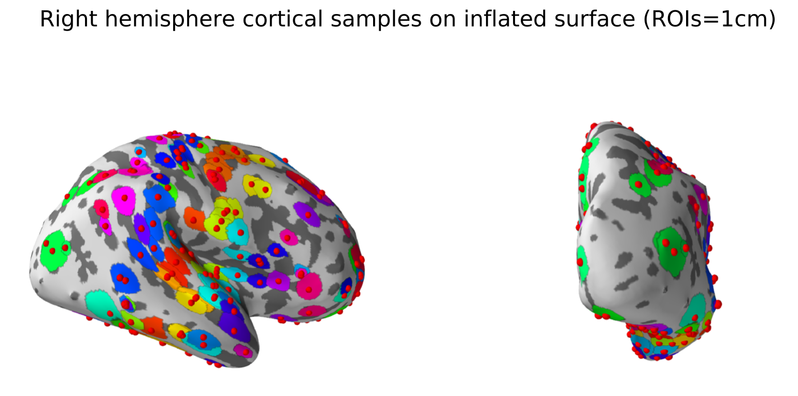

# Allen Human Gene Expression Atlas Samples Mapped to Individual and Common (fsaverage) Space

1. Freesurfer v.6 Reconstruction of cortical surface (pial and white matter surfaces) using T1-weight and T2-weighted MRIs for all 6 subjects.

Note: T2-weighted MRIs were used to improve accuracy of pial surface reconstruction. 

2. Cortical samples were extracted and they were mapped onto white matter surface. 

3. Circular surface-based region-of-interests (ROIs) with 5 mm radius were created for each sample. 

4. Circular ROIs were mapped to fsaverage space. 

